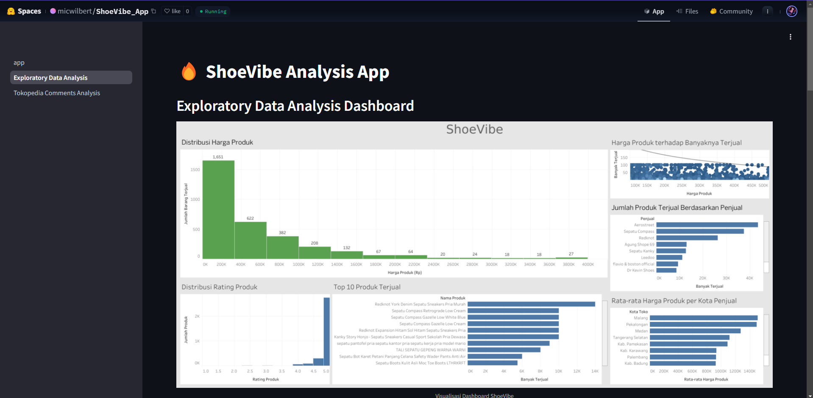

# ShoeVibe!

**Menilai Ulasan, Memahami Perasaan!**

  

<h1 align="center">Hallo Guys👋, We are RMT Batch-037 FTDS</h1>
By Achmed Alridho Zulkarnaen, Michael Wilbert, Catherine Kezia, and Andrew Ananta

<h2 align="left">The Dataset</h2>
 

    
    

For the dataset we scrape Tokopedia data using Selenium and Beautiful Soup.

## Deployment Link

We deploy the application using Huggingface, feel free to click the Huggingface logo above to use the application!

<h2 align="left">App Description</h2>
ShoeVibe is an application designed to analyze customer sentiment for men's shoes on Tokopedia. Using Natural Language Processing (NLP), the app identifies and extracts the most frequent words from both positive and negative reviews for each product. By highlighting these key terms, ShoeVibe helps both buyers and sellers gain insights into the strengths and weaknesses of the product. While the application does not provide direct recommendations for product improvements, it enables users to interpret the feedback themselves and make informed decisions based on the analysis of the most common words in reviews.

## Background

As part of Tokopedia's data team, we are tasked with addressing a growing challenge in the rapidly expanding e-commerce landscape. With the increasing demand for men's shoes on Tokopedia, it's become more important for both buyers and sellers to gain insights from the vast number of product reviews left by customers. Tokopedia has noticed that while these reviews are valuable for understanding customer perceptions, the sheer volume of feedback makes it difficult for users to quickly process and interpret the sentiment behind the comments.
Our team of four has been assigned the responsibility of developing an application that can automatically analyze customer reviews for men's shoes on Tokopedia. This tool uses Natural Language Processing (NLP) with a transfer learning approach via the NNLP model to process and categorize the sentiments expressed in these reviews. The goal is to provide clear insights into which words or themes appear most frequently in positive and negative reviews for each product. By extracting these insights, buyers can better understand the strengths and weaknesses of the products, while sellers can use the feedback to improve their offerings. This project ultimately aims to streamline the process of interpreting customer sentiment, allowing both buyers and sellers to make more informed decisions.

## Objective

The main objective of this project is to develop an application that can automatically perform sentiment analysis on product reviews for men's shoes on Tokopedia. By utilizing Natural Language Processing (NLP) techniques and transfer learning using the NNLP model, this application aims to analyze and classify sentiments in product reviews, both positive and negative. Additionally, this project seeks to provide clearer insights into the words or themes that frequently appear in positive and negative reviews for each shoe product. This will help buyers better understand the strengths and weaknesses of products, and provide sellers with valuable feedback that can be used to improve product quality and services. The project also aims to optimize the data analysis process, reducing the time and effort required to manually assess consumer perceptions. In the future, the developed model is expected to be applied to other products on Tokopedia, with flexibility to analyze other product categories. Overall, this project aims to enhance the understanding of customer sentiment and provide data-driven insights to improve the shopping experience on Tokopedia.

<h2 align="left">Process & Method</h2>

To develop this application, we followed these steps. The process began with data scraping from Tokopedia using Selenium and Beautiful Soup. Next, we analyzed the data using Python and created visualizations with Tableau. Following the analysis, we built a deep learning model utilizing NLP and the B-LSTM method. Finally, we deployed the application using Streamlit and Hugging Face.

<h2 align="left">ShoeVibe Application Guide</h2>

  

1. Open the Application: Access the app through the deployment link on Hugging Face. Then you can choose the "Tokopedia Comments Analysis"
on the menu (Left top of the screen).

  

2. Enter Product Link: Copy the product link for men’s shoes from Tokopedia (red circle in picture above) and paste it into the input field provided.

  

3. Analyze Data: Click the "Analyze" button (red circle) to start the sentiment analysis process.

  

4. View Results:

   - The analysis results will display the most frequently mentioned words in positive and negative reviews.

   - You will also see the total number of positive and negative reviews for the product.
   

  

5. Use Insights:

   - Buyers can understand the strengths and weaknesses of the product based on customer feedback.

   - Sellers can evaluate customer feedback to improve the quality of their products or services.
   

6. Repeat the Process: You can analyze reviews for other products by entering a new link.

<h2 align="left">EDA Page Views</h2>

  

  

You can explor this page by clicking the "Exploratory Data Analysis" option on the menu in the application, happy exploring!

## Contributor

1. [Achmed Alridho Zulkarnaen, Github (Link)](https://github.com/alridho32)
2. [Catherine Kezia Wijaya, Github (Link](https://github.com/catkezzz)
3. [Michael Wilbert Puradisastra, Github (Link)](https://github.com/micwilbert)
4. [Andrew Ananta Aryatama, Github (Link](https://github.com/DruCh4n)

  

 --> --> -->
